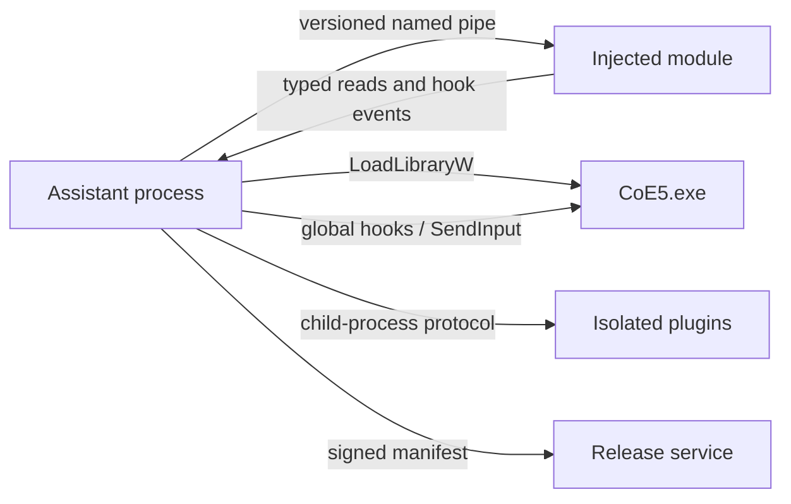

# Architecture

## Processes

### Assistant

The external process owns:

- tray and technical-codex window;
- configuration, named profiles, and profile matching;
- process discovery, launch, fingerprint verification, and DLL injection;
- persistent degraded mode and external restart fallback;
- low-level keyboard/mouse hooks and translated input;
- explicit Windows debugger sessions;
- Lua execution and out-of-process plugin supervision;
- local logs, dump export, and signed update checks.

### Injected module

The `cdylib` owns only work requiring process-local access:

- validated RVA/signature resolution;
- typed memory snapshots;
- MinHook detours and event publication;
- capability-gated internal calls and writes;
- named-pipe client transport.

`DllMain` disables thread notifications and schedules initialization beyond the loader lock. It performs no pipe I/O, allocation-heavy setup, hook creation, logging, or Rust unwinding under the loader lock. Release builds use `panic = "abort"`.

### Protocol

Messages use length-delimited JSON during development and carry explicit protocol and schema versions. The protocol defines:

- handshake and executable fingerprint;
- capability availability and failure reasons;
- memory snapshots;
- hook subscriptions and events;
- profile capture/apply requests;
- debugger and diagnostics events;
- plugin requests isolated from raw process handles.

High-rate tracing may later use a shared-memory ring buffer negotiated through the pipe; control traffic remains on the pipe.

## Compatibility

A symbol manifest is selected by executable SHA-256. A symbol becomes callable or hookable only when:

1. the expected section and protection match;
2. the masked signature matches exactly once;
3. its structural invariants pass;
4. the capability's dependency set is complete.

Failure disables that capability without preventing external monitoring, hotkeys, rebinding, or restart fallback.

## Restart

The restart chord is rebindable and requires two presses inside the configured interval. The first press visibly arms the action.

1. Capture live configuration and compare it with the active named profile.
2. If an internal restart capability is validated, execute its declared transaction and postconditions.
3. Otherwise request graceful exit, terminate only after timeout, relaunch with the profile's CLI map settings, and automate Setup Participants externally.
4. Prove the role/configuration match and map identity differs.

Internal restart remains unavailable for CoE5 5.39 until the research repository records dynamic teardown, heap/RNG, restore-order, and repeated-cycle evidence.

## Debugger

Normal injected operation does not make CoE5 a debuggee. Entering Debug Mode explicitly acquires Windows debug ownership and exposes modules, threads, contexts, software/hardware breakpoints, stepping, memory, symbols, and `iced-x86` disassembly. Leaving Debug Mode removes breakpoints and detaches without terminating CoE5.

Lua runs in the Assistant process. Scripts receive typed, capability-filtered handles and never raw injected pointers. Compiled plugins run in child processes and receive the same versioned model through IPC.

## Storage

- `%APPDATA%/AzazelsCoe5Assistant/config.toml`
- `%APPDATA%/AzazelsCoe5Assistant/profiles/*.toml`
- `%LOCALAPPDATA%/AzazelsCoe5Assistant/logs/`
- `%LOCALAPPDATA%/AzazelsCoe5Assistant/dumps/`
- `%LOCALAPPDATA%/AzazelsCoe5Assistant/cache/`

Profiles never overwrite silently. Live differences produce Update, Save as, or Ignore. Automatic profile selection occurs only when exactly one profile matches; a manual lock always wins.
